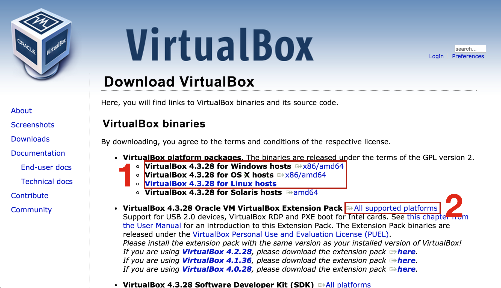
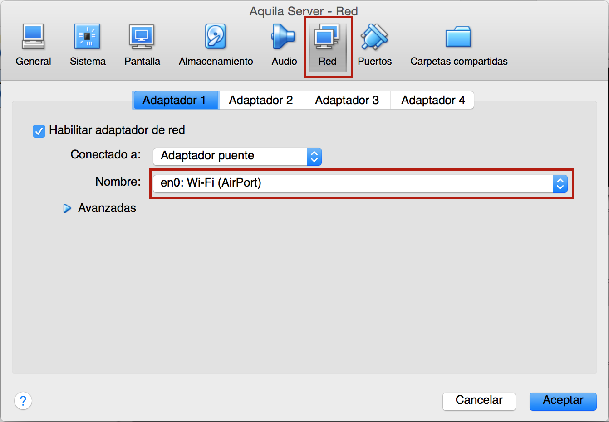

# Aquila Server VirtualMachine

This Virtual Machine comes preinstalled with all the necessary software for running the aquila hub easily.

# Use

1. Start the VM and login with user: ``aquila``, password: ``aquila``. (Pleas note that while keying the password, nothing will be shown in the screen, this is normal).
2. Connect an Altair programmed as Bridge to the PC and connect it to the VM from the menu ``Devices / USB Devices / [Your USB-Serial port]``.
3. Start aquila-server with the command: ``aquila-server``

**Note: ** If there is an error saying that it cannot find the Bridge, execute the following command and retry:
``sudo chmod 777 /dev/ttyUSB0``

# Installation

1. Download and install **VirtualBox** and **VirtualBox Extension Pack** from: https://www.virtualbox.org/wiki/Downloads

2. Download the VM File from "Releases" of this repository.
3. Unzip it wherever you like (on Windows, unzip it with http://www.7-zip.org/).
4. Open it by double clicking “Aquila Server.vbox” (blue icon on Windows)
5. VirtualBox Administrator should have been opened, click “Configuration” and go to “Network"
6. Make sure that the Name of the network adapter is the one you are using for connecting to the Internet (WiFi or Ethernet).

7. Now you can start the Virtual Machine.

# Technical details of the VM

- Operating System: Ubuntu Server 14.04 32bits
- Installed Software: aquila-server, nodejs v0.10.39, mongodb, node-red, node-red-aquila, node-red-contrib-freeboard
- Default User: aquila
- Password: aquila

